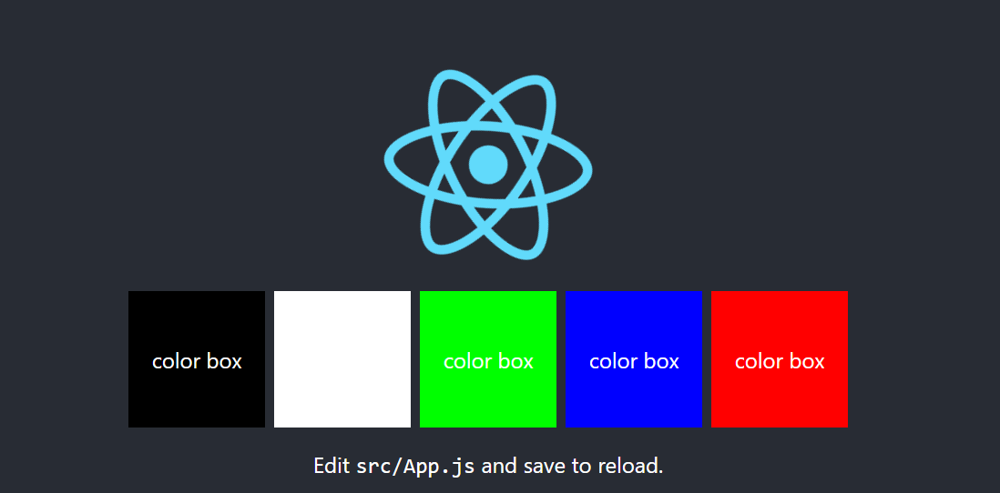
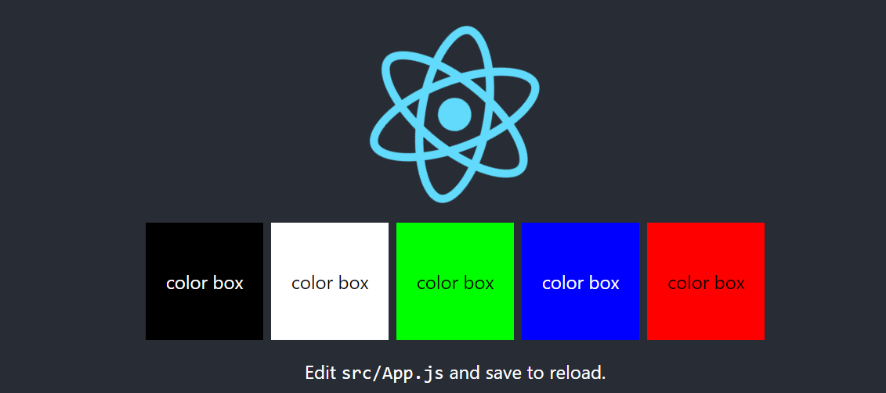

# The Simplest Color Checker Library

A powerful, dependency-free color manipulation library for JavaScript/TypeScript applications.


<div style="text-align:center;">
  <h3 >Manipulate colors easily</h3>
  <h4 >This (text has a very low contrast) : </h4>
    <br />
    
    <br />
    <h4 >Can be turned easily into this: (High contrast with the background)  </h4>
    
    <br />
</div>


## Features

- Color validation (HEX, RGB, HSL)
- Brightness calculation
- Contrast ratio calculation
- Color format conversions
- Color palette generation
- CSS integration utilities
- WCAG accessibility checks

## Installation

```bash
npm install the-simplest-color-checker
```

## Full API
Go to https://github.com/amans199/the-simplest-color-checker/blob/master/API.md


## Basic Usage

```typescript
import { isLight, getContrastRatio } from 'the-simplest-color-checker';

// Check if a color is light or dark
const color = '#3498db';
console.log(isLight(color)); // false

// Calculate contrast ratio
const ratio = getContrastRatio('#000000', '#ffffff');
console.log(ratio); // 21 (maximum contrast)
```

## API Documentation

### Validation

```typescript
isValidHex(color: string): boolean
isValidRGB(r: number, g: number, b: number): boolean
isValidHSL(h: number, s: number, l: number): boolean
```

### Color Conversions

```typescript
hexToRGB(hex: string): { r: number; g: number; b: number }
rgbToHex(r: number, g: number, b: number): string
rgbToHSL(r: number, g: number, b: number): { h: number; s: number; l: number }
```

### Brightness

```typescript
getBrightness(color: string): number
isLight(color: string): boolean
```

### Contrast

```typescript
getContrastRatio(color1: string, color2: string): number
```

## Contributing

1. Fork the repository
2. Create your feature branch (`git checkout -b feature/amazing-feature`)
3. Commit your changes (`git commit -m 'Add some amazing feature'`)
4. Push to the branch (`git push origin feature/amazing-feature`)
5. Open a Pull Request

## License

This project is licensed under the MIT License - see the LICENSE file for details.